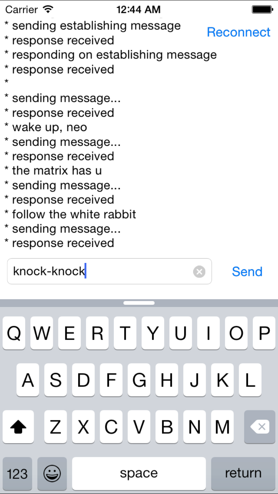

# Installation and usage

To install pods, please open project folder and run 
```
  pod install
```
1. Open `WebsocketExampleClient.xcworkspace` and start project.
2. If you see error, it means, that server is not running. However we really need it to move further.
Be brave, open server folder and follow steps in [ReadMe](https://github.com/cossacklabs/mobile-websocket-example/blob/master/server/README.md)
3. When server is running, you will see connect message on screen.
4. Enter anything into textfield, and press send button.
5. Enjoy!


